# phosphor

**The green-screen database desktop of 1988, reborn. Dot prompt, banded
reports, painted forms, user-built menus — on top of a database that is
wicked fast, compressed, networked, and monitors itself. 1988 the way it
should have turned out.**

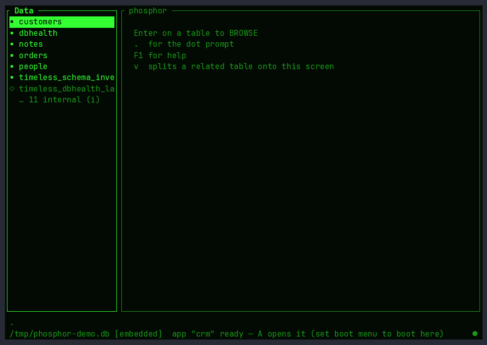

```
┌──────────────────────────────────────────────────────────────┐
│  PHOSPHOR                                     [F1 Help]      │
│                                                              │
│   Data      Queries     Forms      Reports    Apps    Admin  │
│   ────      ───────     ─────      ───────    ────    ─────  │
│   customers CRM-open    cust-entry monthly    CRM     health │
│   orders    late-pay    order-fast aging      intake  logs   │
│   metrics   <create>    <create>   labels     <create>       │
│                                                              │
│  . _                                                         │
│                                                              │
│  ─ dot prompt ────────────────────── db: crm.db ── 0.19ms ─  │
└──────────────────────────────────────────────────────────────┘
```

## The dream

Twenty years of dreaming, stated plainly: terminals never stopped being the
fastest UI humans have ever had. The great late-80s database desktops —
dBASE IV, Paradox, FoxPro — let a non-programmer build a real business
application — data, forms, reports, menus — in an afternoon, and every
keystroke responded *instantly*. We traded that for web apps with 400 ms
round trips and forms built by committees.

phosphor brings it back, and forward:

- **The dot prompt.** A live command line for SQL and app commands, with
  history. The fastest interface ever shipped with a database.
- **BROWSE and EDIT.** Grid-edit any table; flip to a record form with one
  key. Master-detail linked browses (`SET RELATION`, reborn as foreign
  keys driving the UI).
- **Painted forms.** A full-screen form designer — place fields, labels,
  pickers, validations — saved *into the database itself*.
- **Banded reports.** Page header, group bands, detail, totals, footer —
  the report writer that generated forty years of business paperwork,
  plus mailing labels.
- **Query By Example.** A QBE grid that writes the SQL for you and shows
  it — the original "low-code" done honestly.
- **The Applications Generator.** Users craft their own menus wired to
  their own forms, queries, and reports — then hand the result to their
  team as *an application*. The fastest CRM in existence, built by the
  person who actually uses it.
- **DB intelligence built in.** Powered by
  [timeless-libsql](https://github.com/awksedgreep/timeless-libsql):
  compressed metrics/logs/traces in the same file, and a `dbhealth`
  report that tells you — in plain language — whether the database is
  healthy and what to do about it. PMM energy, F10 away.
- **Two ways to connect, one UI:** open a SQLite/libSQL file directly
  (embedded, zero infrastructure, microsecond queries) or speak to a
  self-hosted `sqld` over HTTP (multi-user — the Novell NetWare of this
  story, minus the lock files).
- **The apps live in the database.** Forms, menus, reports, queries are
  rows, not files on someone's C: drive. Copy the `.db`, you copied the
  application. Replicate it with libSQL, you *deployed* it.

Green P1 phosphor by default. Amber P3 for the sophisticates. `Esc` always
means what you think it means.

## Status

**All five phases work today** — the browser, the network, the health
console, the builders, and the applications runtime:

```sh
cargo run -- path/to/any.db            # embedded: any SQLite/libSQL file
cargo run -- http://localhost:8880     # remote: self-hosted sqld over HTTP
# PHOSPHOR_TOKEN=...                     for authenticated servers (Turso-style)
# PHOSPHOR_EXT=.../libtimeless_ext.so    embedded telemetry + dbhealth
```

- **Browse** — schema sidebar (tables ▪, views ◇), virtualized **BROWSE**
  grid that pages through millions of rows, **split view** (`v`) that
  puts a related table beside the master — cursor-linked, mouse-clickable,
  remembered — **EDIT** record form on Enter
  (PICTURE-style ¶ pk / * not-null markers, typed parsing), `a`dd and
  `x`-twice-delete rows, `find <text>` + `n` to seek, a live **dot
  prompt** (`.`) running real SQL with history, Tab completion, and
  Ctrl-A/E/U/W line editing, **CSV import/export**
  (`import <table> <path>` / `export <table|SELECT> <path>`), four themes
  (`set theme green|amber|paper|blue`), F1 help, query latency in the
  status bar. **F1 anywhere** opens context-sensitive help written in
  English — the topic for the screen you are on, ←→ to wander the manual.
- **Network** — the same UI over Hrana HTTP to self-hosted
  [sqld](https://github.com/tursodatabase/libsql): one `DbLink` trait,
  two backends, chosen by the argument. Multi-user, no lock files —
  the part 1988 got wrong, fixed.
- **DBHEALTH console** — `F10` (or `health` at the prompt) on a database
  carrying [timeless-libsql](https://github.com/awksedgreep/timeless-libsql)
  telemetry: the plain-language health report (worst first), sparkline
  trends fed from the compressed series, and `s` to take a live sample
  right there — works identically over a file or over sqld. The status
  bar carries the health dot at all times. `advise` at the prompt lists
  foreign-key columns missing an index (with the exact `CREATE INDEX`)
  and a VACUUM nudge when the file is bloated.
- **The builders** — `Q`uery By Example (fill the grid, watch the SQL it
  writes, F2 runs, F6 saves), `R`eports (banded: page headers, group
  bands with subtotals, automatic totals on numeric columns, grand
  totals; preview in a pager, `w` writes the file, `p` prints via
  `lp`/`$PHOSPHOR_PRINT`), `L`abels
  (three-across, zero config), and `F`orms — reorder, relabel, hide,
  and require fields, then press **F2 for the FORM PAINTER**: place
  fields anywhere on a canvas, add title texts, draw boxes
  (`CREATE SCREEN`, reborn) — EDIT and NEW render your painted screen
  from then on.
- **The Applications Generator** — press `A`, craft a menu of actions
  (browse a table, run a saved query or report, execute SQL, or run a
  **Lua script** over a sandboxed API — `query`/`query_one`/`scalar`/
  `execute`/`exists`, `json`, string helpers, and a queued `ui.*`
  surface (`refresh`, `browse`, `query`, `report`, `form`, `prompt`,
  `quit`)), and the result is an *application* stored in `_phosphor_*`
  tables inside the database itself. Then:

  ```sh
  phosphor --app crm.db               # your team's CRM, hotkeys and all
  phosphor --app --readonly crm.db    # kiosk: browsable, no writes
  ```

  Copy the file, you copied the app. Replicate it with libSQL, you
  deployed it.

  Need logic the declarative layer can't express? Bind a sandboxed **Lua
  lifecycle script** — `script customers OnValidate ...`, or edit it
  full-screen with `edit customers OnValidate` — and it runs on save with
  a read/write record. Menu items can carry a `script` action too —
  press `E` in the Applications Generator to edit it full-screen.

## The CRM user story — empty file to running app in 5 minutes

The founding test from `DESIGN.md`: *a person who is not a programmer
sits down with phosphor, creates tables, paints an entry form, defines
two reports and a menu — and their team uses that application daily.*
This is that story, every keystroke captured and verified:

> `phosphor crm.db` on an empty file → 11 chapters, no SQL files,
> no code — copy the `.db` and you shipped the app.

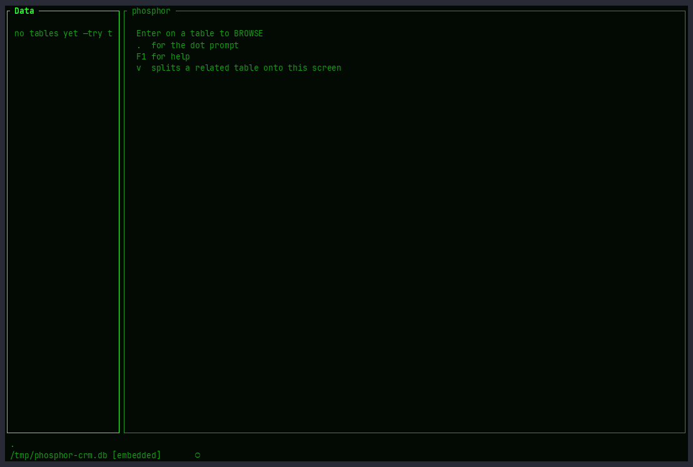

| ch | what happens | on film |
|---|---|---|
| 01 | `C` → TABLE DESIGNER: `customers` with `name`/`city`, five records typed live | 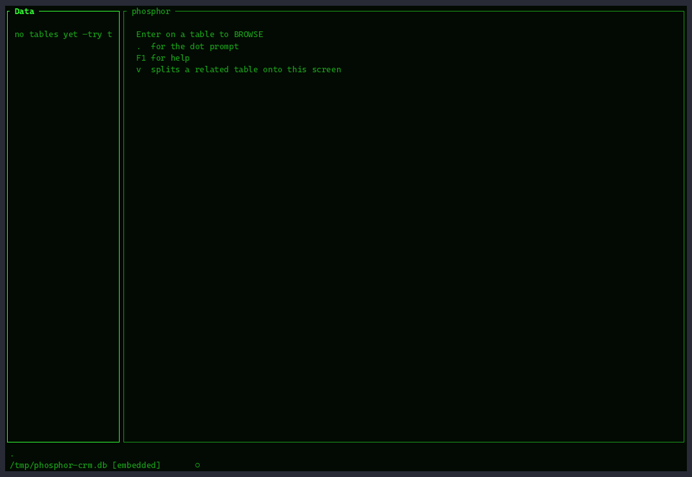 |
| 02 | `C` → `orders` with `customer_id INTEGER REFERENCES customers(id)` — FK enforcement on, orphan rejected, then bulk insert |  |
| 03 | `ALTER TABLE` adds `balance`, a `leads` table is created and dropped — schema evolution without leaving the UI | 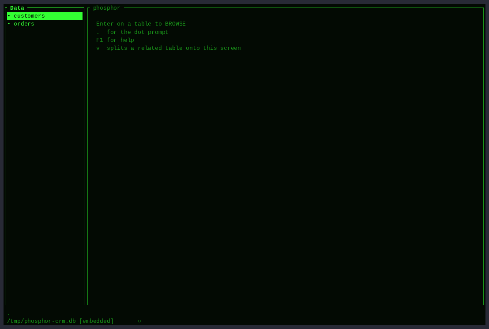 |
| 04 | `contacts` + `interactions` (both FK → customers) and `v` cycling `contacts → interactions → orders` |  |
| 05 | `F` → `F2` FORM PAINTER: place fields, `CUSTOMER CARD` title, box, `F6` save — `a` now shows the painted card, required `name` enforced |  |
| 06 | `v` split driven by keys *and mouse*: click Grace, `PgDn`, `Tab` into detail, `v` cycles | 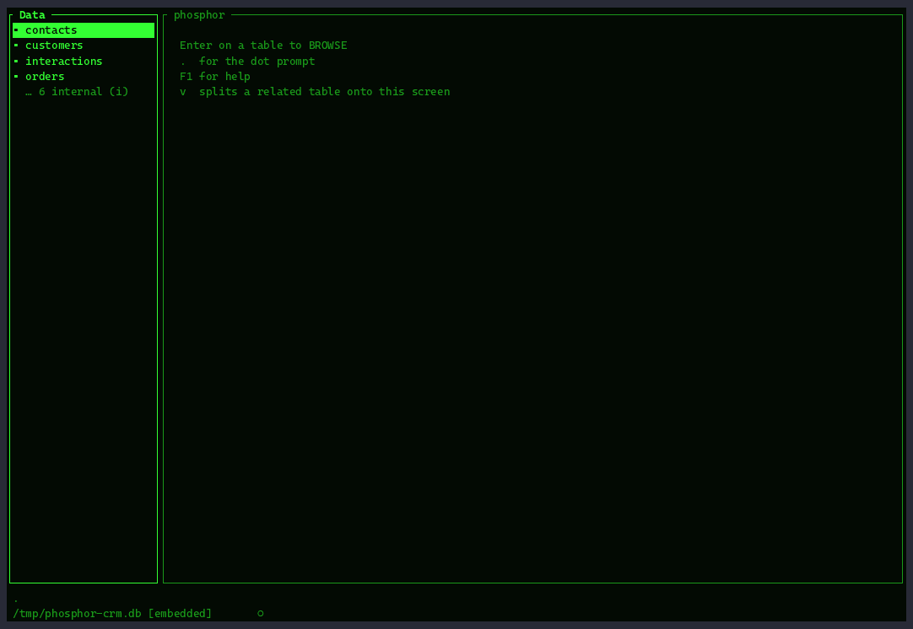 |
| 07 | `Q` QBE: `balance > 0` + sort ▼ → `F2` run, `F6` save as `debtors` |  |
| 08 | `R` report grouped by `region` → subtotals/grand total, `w` writes `report_orders.txt`; `L` mailing labels |  |
| 09 | `.` prompt: `run debtors`, `find Grace` + `n`, `set theme amber/green` |  |
| 10 | `A` Applications Generator: `Customers` (browse), `Orders by region` (report), `Debtors` (query) → `F2` live menu, hotkeys | 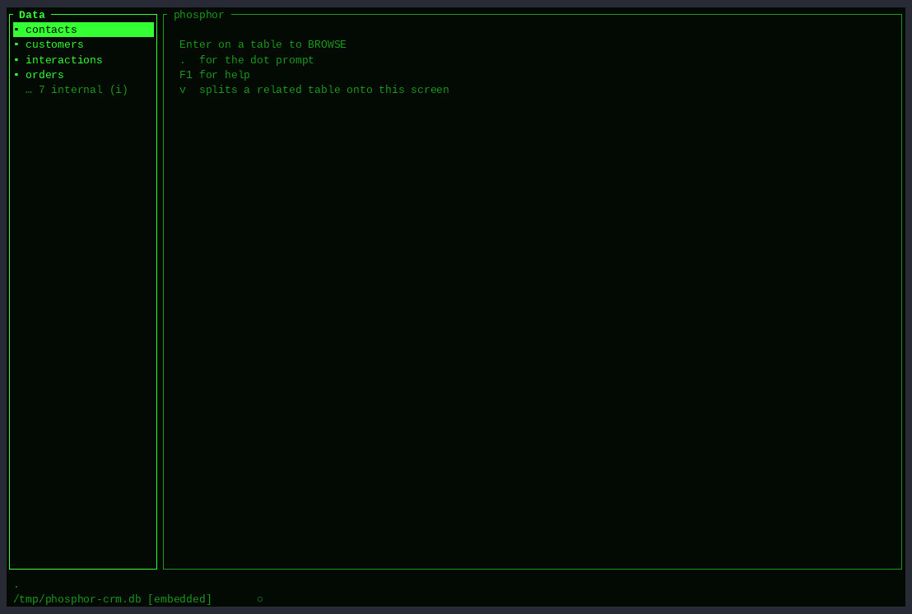 |
| 11 | `phosphor --app crm.db` — the database *is* the application | 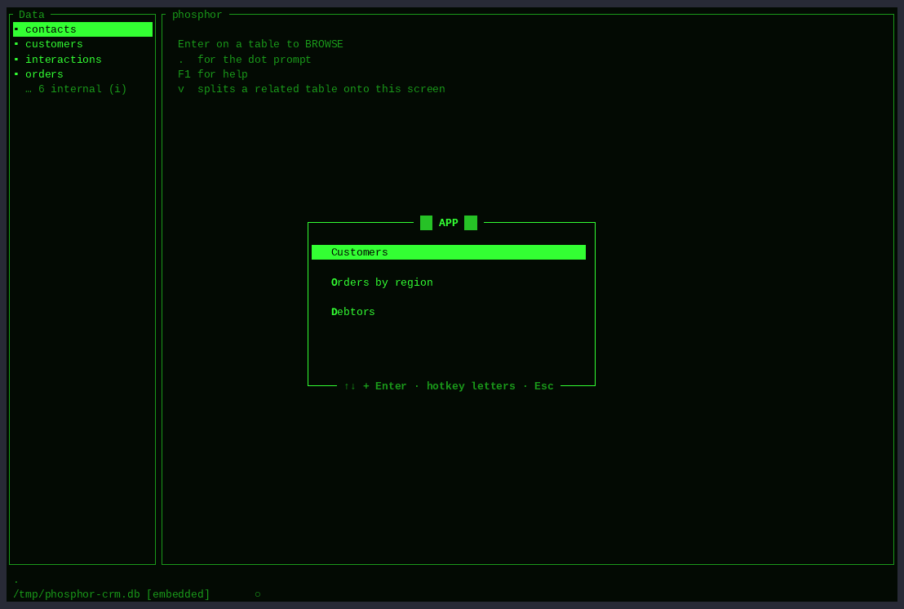 |

Every chapter is a separately recorded, separately verified cast
(`tools/demo/crm.py` replays each through a terminal emulator and asserts
on-screen text before merging). The full 5-minute cut above is the merge
`docs/demo/crm.cast` → `crm.gif`.

> Follow along step-by-step: [Build a CRM in ten minutes](docs/BUILD-A-CRM.md).

## Watch it work

Every GIF below is generated headlessly by `tools/demo/demo.sh` — a
scripted pty session rendered with agg, so the demos can never drift
from the real program.

| | |
|---|---|
| **The CRM, from nothing** — same 5-minute story as above, single GIF |  |

<details>
<summary>CRM chapters (each stage as its own GIF)</summary>

| | |
|---|---|
| 01 · an empty db becomes customers |  |
| 02 · orders + the first foreign key |  |
| 03 · designs change: alter, drop, rethink |  |
| 04 · contacts, interactions — and the split cycle |  |
| 05 · CREATE SCREEN: the painted customer card |  |
| 06 · the split view, driven by keys and mouse |  |
| 07 · query by example → saved query |  |
| 08 · the banded report + mailing labels |  |
| 09 · the dot prompt runs the shop |  |
| 10 · wiring the application menu |  |
| 11 · --app: the database IS the application |  |

</details>
| **Split BROWSE** — `v` splits a related table onto the screen; the cursor drives it, the mouse re-points it, layouts are remembered | 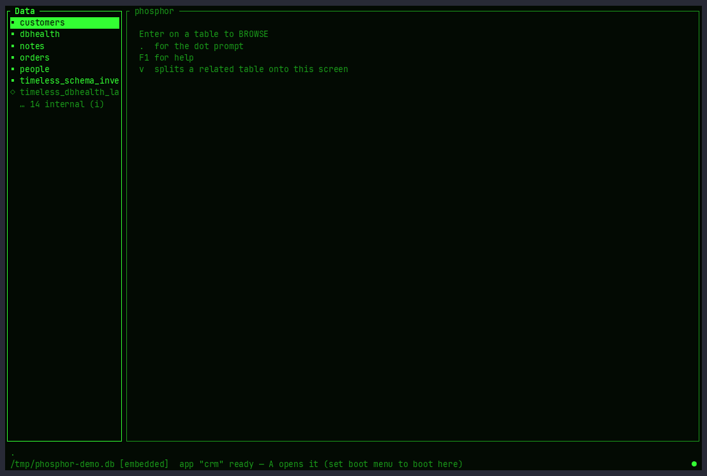 |
| **The builders** — QBE writing its SQL, the banded report with group subtotals, the form painter | 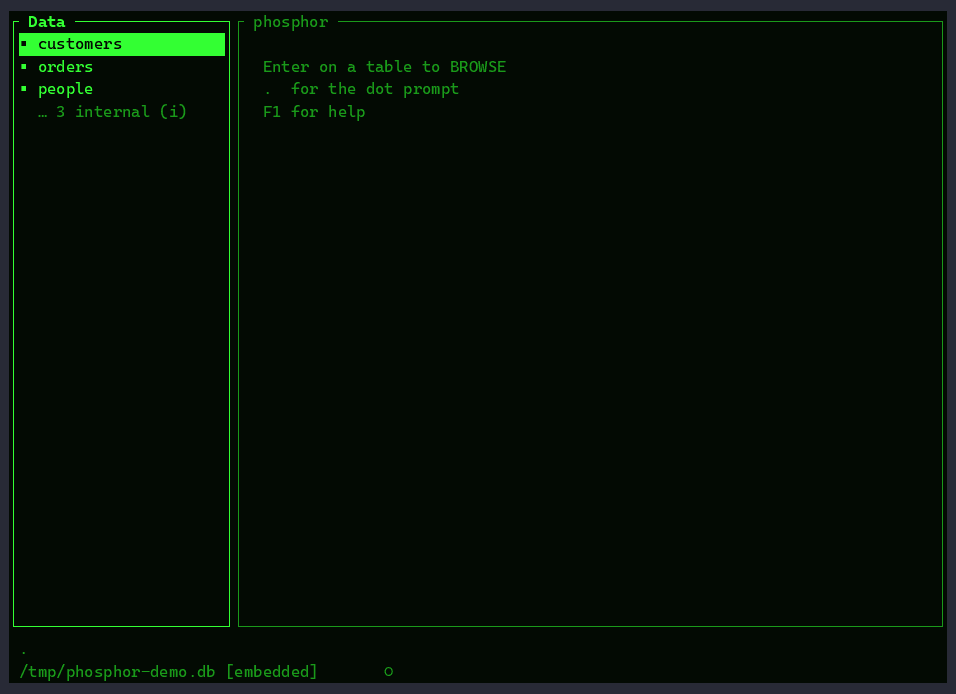 |
| **DBHEALTH, live** — the report and sparklines moving on their own (auto-collection + the live console) | 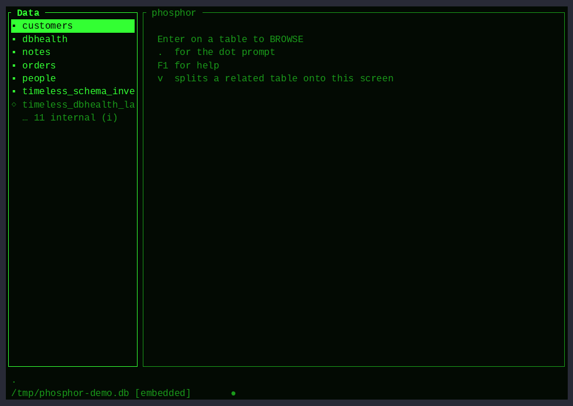 |
| **`--app` mode** — the ▓▓ CRM ▓▓ menu; hotkeys run reports and browses; the database IS the application | 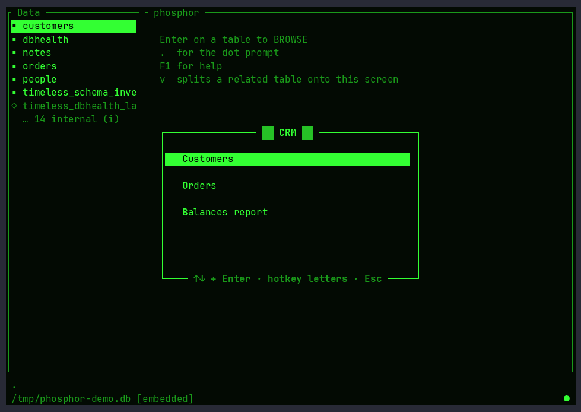 |

**Read more:** the [manual](docs/MANUAL.md) (generated from the
in-app F1 help — `phosphor --manual`), the ten-minute
[Build a CRM](docs/BUILD-A-CRM.md) tutorial, the
[UI tour](docs/UI-TOUR.md) (every screen on film, straight from the
test suite), and [DESIGN.md](DESIGN.md) for the feature revival map
and architecture.

## License

[MIT](LICENSE)

*phosphor is an original work inspired by the terminal database tools of
the late 1980s. It is not affiliated with, endorsed by, or compatible with
dBASE® (a trademark of dBase, LLC), Paradox, FoxPro, or their successors;
historical product names appear only for comparison. phosphor works
exclusively with SQLite and libSQL databases.*
