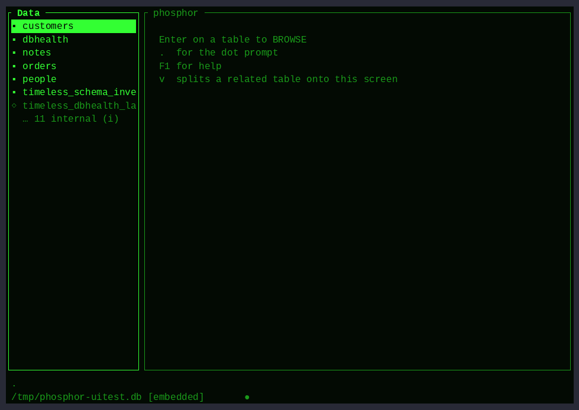

# The UI tour — every screen, on film

These GIFs are the output of `tools/demo/uitest.py` — the full-UI test
sweep. Each one is a scripted pty session with **on-screen assertions**
(a small terminal emulator reconstructs what is actually visible and
checks expected text at scripted moments). They are only regenerated
from a fully green run, so what you see here is what the tests proved:

```sh
python3 tools/demo/uitest.py --render   # assert everything, then render
```

| reel | covers |
|---|---|
|  | first-letter seek, the internals toggle, browse motion (g/G, Home/End), read-only views |
|  | column widths (`+`/`-`) and frozen columns (`f`) |
|  | the painted card, editing a field, required-field refusal, insert, find, double-x delete |
|  | SQL in the grid, error handling, Tab completion, all four themes |
|  | Query By Example: filters, live (wrapping) SQL, run, save, replay by name |
|  | QBE teaches the rest: `J` cycles FK joins, `g` adds GROUP BY |
|  | banded report with group subtotals, save-as (renameable), writing to file, mailing labels |
|  | the form designer, `n` adds a computed field, the painter (place, text, box), the painted EDIT |
|  | PICTURE masks and the `F7` foreign-key value picker |
|  | the Applications Generator: add/label/target, live menu, hotkeys, delete, rename the app (`r`) |
|  | the TABLE DESIGNER: fields as rows, the CREATE TABLE writing itself, F2 → empty BROWSE → first record |
|  | the TABLE EDITOR (`E`): add a column with ALTER, and drop a table with the two-press confirm |
|  | record paging: hold PgDn and fly through 500 records in the form; edits save mid-flight |
|  | foreign keys → SET RELATION: declare an FK in the designer (F10), open a parent record, and the child pane follows as you page; F4 opens it as a filtered BROWSE; `v` splits and `H` stacks |
|  | Lua scripting: an `OnChange` lifecycle script rewrites a field on save; a `script` menu item authored in the full-screen editor runs by hotkey |
|  | CSV import/export at the prompt, then the index/vacuum advisor |
|  | the LIVE DBHEALTH console + contextual F1 help |
|  | `--app`: the menu, a report, single-Esc home |
|  | `--app --readonly`: browsable, and every write refused |
