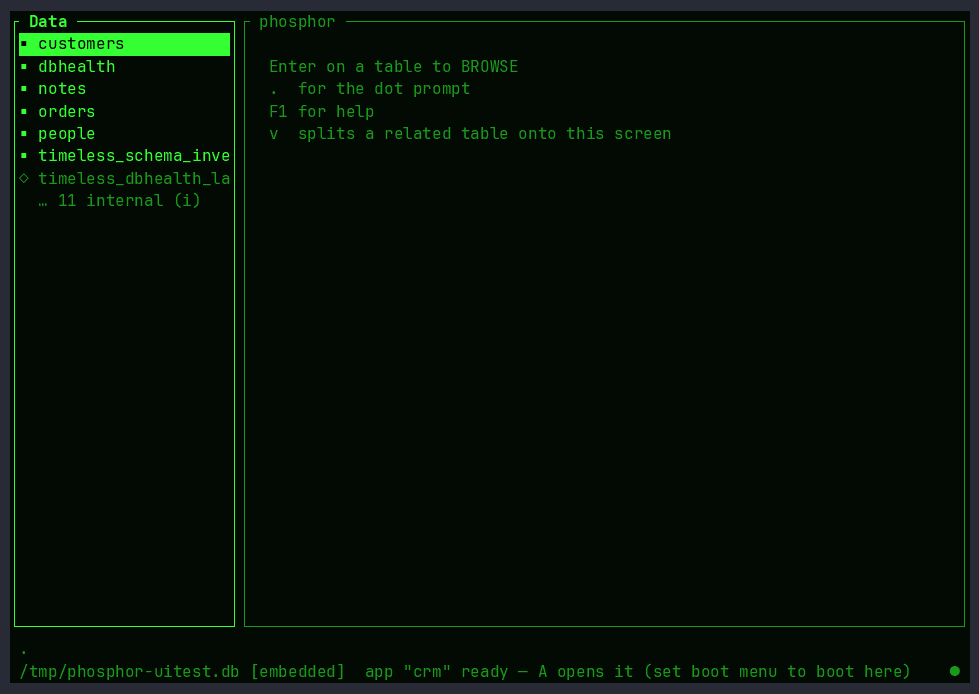
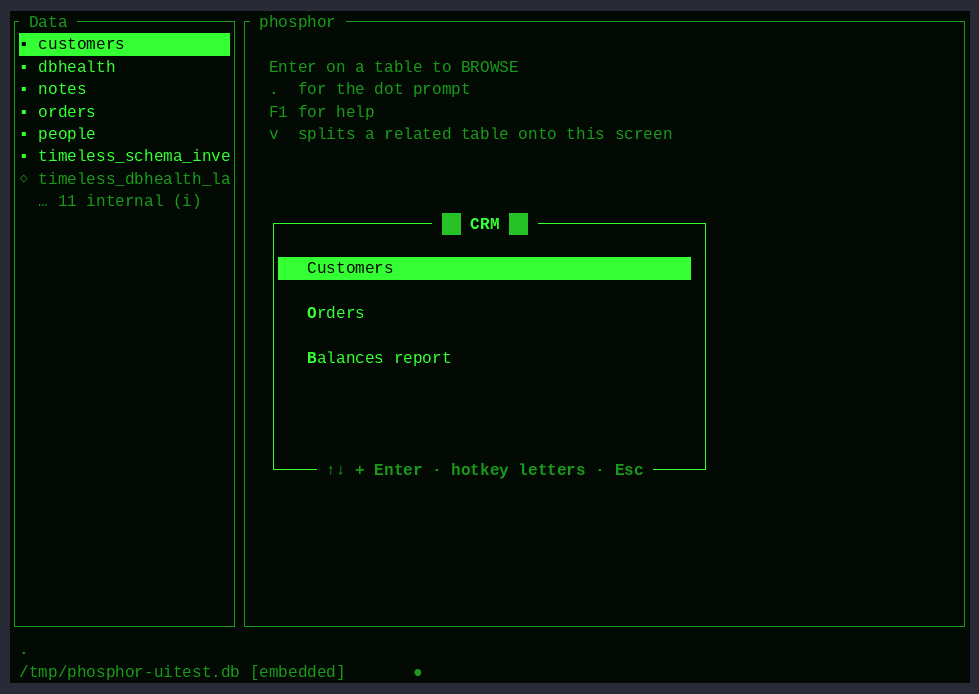

# The UI tour — every screen, on film

These GIFs are the output of `tools/demo/uitest.py` — the full-UI test
sweep. Each one is a scripted pty session with **on-screen assertions**
(a small terminal emulator reconstructs what is actually visible and
checks expected text at scripted moments). They are only regenerated
from a fully green run, so what you see here is what the tests proved:

```sh
python3 tools/demo/uitest.py --render   # assert everything, then render
```

| reel | covers |
|---|---|
|  | first-letter seek, the internals toggle, browse motion (g/G, Home/End), read-only views |
|  | the painted card, editing a field, required-field refusal, insert, find, double-x delete |
|  | SQL in the grid, error handling, Tab completion, all four themes |
|  | Query By Example: filters, live (wrapping) SQL, run, save, replay by name |
|  | banded report with group subtotals, writing to file, mailing labels |
|  | the form designer, the painter (place, text, box), the painted EDIT |
|  | the Applications Generator: add/label/target, live menu, hotkeys, delete |
|  | record paging: hold PgDn and fly through 500 records in the form; edits save mid-flight |
|  | the LIVE DBHEALTH console + contextual F1 help |
|  | `--app`: the menu, a report, single-Esc home |
